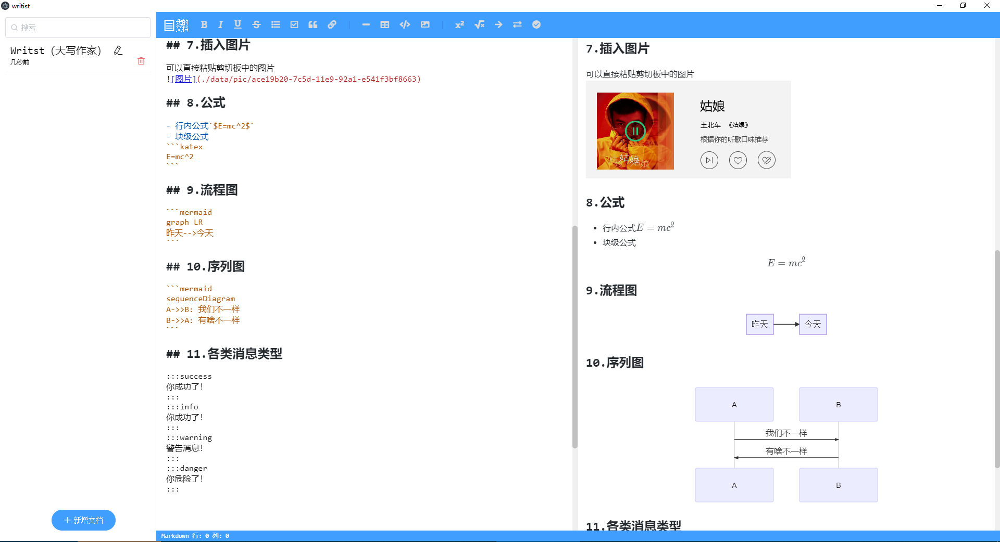

# writist 大写作家

> 一款简单的Markdown编辑器

### 主要技术
- [electron-vue](https://github.com/SimulatedGREG/electron-vue)
- [markdown-it](https://github.com/markdown-it/markdown-it)
- [CodeMirror](https://github.com/codemirror/CodeMirror)

### 功能特性
- 除了基础的markdown语法外还支持以下的扩展解析
    - emoji表情
    - fa图标
    - [KaTeX公式](https://github.com/KaTeX/KaTeX)
    - [mermaid图表](https://github.com/knsv/mermaid)
- 本地存储，可以离线使用

### todo
- [ ] 练手项目，代码写的太差了，持续优化
- [ ] 增加导出pdf功能
- [ ] 云存储功能？？？
- [ ] 缺个Logo,有没有赞助的:)
- [ ] echarts图表解析

### 特别感谢
- 参考或引用了很多markdown-it的扩展，[搜索markdown-it-](https://github.com/search?q=markdown-it-)
- [vue-codemirror](https://github.com/surmon-china/vue-codemirror)，作者很久没更新了，一些新的特性得手动添加

### 预览图


### Build Setup

``` bash
# install dependencies
npm install

# serve with hot reload at localhost:9080
npm run dev

# build electron application for production
npm run build

# lint all JS/Vue component files in `src/`
npm run lint

```
